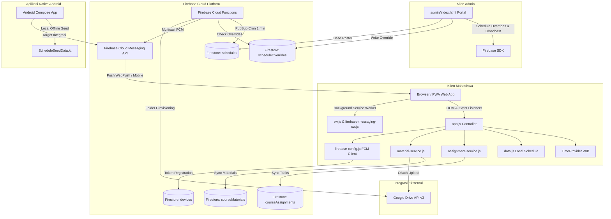

# Arsitektur Sistem TRJT 3A Reminder

Dokumen ini menjelaskan arsitektur perangkat lunak, siklus hidup aplikasi, alur data, pengelolaan state, serta keterkaitan antar komponen dalam sistem **TRJT 3A Reminder**.

---

## 1. Ikhtisar Arsitektur

TRJT 3A Reminder dirancang dengan pendekatan *hybrid client-driven* yang dipadukan dengan layanan komputasi *serverless* berbasis cloud.



---

## 2. Siklus Hidup & Urutan Pemuatan Skrip

Ketika pengguna membuka `index.html`, urutan pemuatan berkas terjadi secara sekuensial:

```text
1. HTML Parse: Head & CSS
   ├── Google Fonts (Inter)
   ├── Lucide Icons SDK (unpkg)
   ├── css/design-system.css (Variabel global, utilitas, styling dasar)
   ├── style inline di index.html (gaya awal sebelum CSS mahasiswa dimuat)
   └── css/student-ui.css (tema mahasiswa terakhir dalam urutan cascade)

2. HTML Parse: Body Markup
   ├── Header navy & branding (.app-header, .brand-logo-box, #header-greeting, #header-date, #btn-header-bell)
   ├── Main Container & View Sections:
   │   ├── #view-beranda (hero dinamis di banner .campus-cover, menu .home-shortcuts 4×2, ringkasan, agenda, tugas)
   │   ├── #view-jadwal (Day selector kapsul, timeline kelas mingguan)
   │   ├── #view-notifikasi (Riwayat notifikasi & filter)
   │   ├── #view-dosen (Direktori 6 dosen pengampu)
   │   └── #view-pengaturan (Pengaturan alarm, tema, switch PWA)
   ├── Modals & Sheets (Tambah Tugas, Materi, Piket, Mahasiswa, Tema)
   └── Dock navigasi bawah (.bottom-nav, tombol Jadwal tengah .nav-primary)

3. Skrip Eksternal (Firebase Compat SDK v10.12.0)
   ├── firebase-app-compat.js
   ├── firebase-firestore-compat.js
   ├── firebase-auth-compat.js
   ├── firebase-functions-compat.js
   └── firebase-messaging-compat.js

4. Skrip Aplikasi Internal
   ├── js/firebase-config.js (Koneksi database, listener token, sinkronisasi FCM)
   ├── js/time-provider.js (Inisialisasi objek TimeProvider dengan zona waktu Asia/Jakarta)
   ├── js/data.js (Sumber data lokal WEEKLY_SCHEDULE, LECTURERS, CLASS_DUTY_ROSTER, PRACTICAL_GROUPS)
   ├── js/drive-service.js (Status koneksi Google Drive client)
   ├── js/material-service.js (Layanan materi kuliah)
   ├── js/assignment-service.js (Layanan tugas & listener real-time Firestore)
   └── js/app.js (Eksekusi fungsi init(), penyiapan event listeners, dan loop timer tick())
```

---

## 3. Proses Inisialisasi Aplikasi (`init()`)

Fungsi `init()` di dalam [js/app.js](file:///c:/laragon/www/TRJT%203A/js/app.js) menjalankan tahapan berikut:

1. **Pemeriksaan Elemen Root:** Memverifikasi container penting ada di DOM (`#hero-card-container`, `#weekly-cards-container`, dll.).
2. **Inisialisasi Tema:** Membaca preferensi tema tersimpan dan menerapkan `data-theme` pada `<html>` serta `<body>`; pilihan yang tersedia ialah `light`, `dark`, dan `system`.
3. **Pendaftaran Service Worker:**
   - Memanggil `navigator.serviceWorker.register('./sw.js')` untuk caching aset offline.
   - Menginisialisasi Firebase Messaging via `js/firebase-config.js` dan mendaftarkan `firebase-messaging-sw.js` untuk push background.
4. **Pemasangan Listener Real-time Firestore:**
   - Mendengarkan koleksi `scheduleOverrides` (untuk perubahan jadwal, pembatalan, dan ganti ruang).
   - Mendengarkan koleksi `courseAssignments` melalui `assignmentService.init()`.
5. **Render Tampilan Awal:**
   - Memanggil `renderHeader()` untuk menampilkan waktu terkini.
   - Memanggil `renderHeroCard()` untuk kartu kelas berikutnya.
   - Memanggil `renderTodayTimeline()` untuk agenda kelas hari ini.
   - Memanggil `renderWeeklySchedule()` untuk tab jadwal mingguan.
   - Memanggil `renderUpcomingTasksWidget()` untuk widget tugas di beranda.
   - Memanggil `renderDosenList()` untuk tab direktori dosen.
   - Memanggil `renderPiketBadge()` untuk badge piket kelompok minggu ini.
6. **Memulai Heartbeat Timer:**
   - Menjalankan `setInterval(tick, 1000)` untuk memperbarui jam, countdown, dan evaluasi H-10 setiap detik.

---

## 4. Pengelolaan State Aplikasi

Sistem menggunakan pengelolaan state berbasis objek modular dan penyimpanan lokal:

| State | Variabel / Lokasi | Cara Berubah | Dampak UI |
|---|---|---|---|
| **Tab Aktif** | Variabel `currentTab` di `app.js` | Fungsi `switchTab(tabName)` saat tombol navigasi bawah ditekan | Menambahkan kelas `.active` pada view dan `.nav-item` terkait; `body.home-active` aktif hanya di Beranda |
| **Tema Tampilan** | Preferensi tema di localStorage | Modal pemilih tema (`selectTheme('light'\|'dark'\|'system')`, lalu `applyTheme()`) | Mengubah atribut `data-theme` pada `<html>` dan `<body>` |
| **Hari Terpilih** | Variabel `selectedDayId` di `app.js` | Pengguna menekan tombol kapsul hari (`selectScheduleDay(dayId)`) | Memperbarui kelas `.active` pada kapsul hari dan merender kartu jadwal hari tersebut |
| **Jadwal Override** | Variabel `scheduleOverrides` di `app.js` | *Snapshot listener* koleksi Firestore `scheduleOverrides` | Mengubah status kelas menjadi `Dibatalkan`, memperbarui ruang atau jam secara *real-time* |
| **Daftar Tugas** | `assignmentService.assignments` & `localStorage: trjt_assignments_cache` | *Snapshot listener* koleksi `courseAssignments` atau aksi CRUD | Memperbarui widget tugas di beranda dan modal daftar tugas |
| **Waktu Sistem** | `window.TimeProvider` | Waktu nyata perangkat atau `localStorage: trjt_simulation_time` | Menghitung kelas aktif, sapaan (*Selamat pagi/siang/sore/malam*), dan pemicu H-10 |

---

## 5. Alur Pembacaan Jadwal & Penerapan Override

1. **Jadwal Dasar (Base Roster):**
   - Di sisi klien web, jadwal dasar diambil dari `window.WEEKLY_SCHEDULE` di [js/data.js](file:///c:/laragon/www/TRJT%203A/js/data.js) yang memuat 11 mata kuliah resmi Semester 5.
2. **Sinkronisasi Override dari Admin:**
   - Komti/Admin dapat menyimpan perubahan pada dokumen `scheduleOverrides/{scheduleId}` di Firestore:
     ```json
     {
       "scheduleId": "senin-jaringan-komputer-lanjut",
       "isCancelled": false,
       "room": "Lab. Jaringan Komputer",
       "startTime": "10:30",
       "endTime": "12:10",
       "note": "Pindah lab karena instalasi kabel",
       "updatedAt": "2026-09-30T08:00:00Z"
     }
     ```
3. **Penggabungan Data (*Merging*):**
   - Saat `getEffectiveSchedule(dayId)` dipanggil di `app.js`, jadwal dasar disalin (*clone*), lalu dicek apakah ada dokumen override aktif untuk ID kelas tersebut.
   - Jika `override.isCancelled === true`, kelas diberi tanda batal dan badge merah muncul.
   - Jika terdapat pergantian ruangan (`room`) atau waktu (`startTime`/`endTime`), nilai efektif diperbarui sebelum kartu dirender.

---

## 6. Perhitungan Waktu & Zona Waktu (Asia/Jakarta)

Aplikasi beroperasi secara mutlak pada zona waktu **WIB (UTC+7 / Asia/Jakarta)**:
- **`TimeProvider` (`js/time-provider.js`):** Menggunakan `Intl.DateTimeFormat` dengan opsi `timeZone: 'Asia/Jakarta'` untuk memastikan mahasiswa yang membuka aplikasi di luar zona WIB tetap mendapatkan waktu perkuliahan kampus yang valid.
- **Mode Simulasi Sandbox:** `TimeProvider` memeriksa keberadaan nilai simulasi di `localStorage.getItem('trjt_simulation_time')`. Jika aktif, waktu simulasi menggantikan jam asli perangkat, memungkinkan pengembang menguji kondisi hari libur, malam hari, maupun situasi menjelang kelas (H-10) melalui [dev/simulation.html](file:///c:/laragon/www/TRJT%203A/dev/simulation.html).

---

## 7. Mesin Pengingat H-10 (Browser vs Server)

Sistem memiliki dua implementasi mesin pengingat yang saling melengkapi:

### A. Mesin Pengingat Sisi Browser (`js/app.js`)
- **Pemicu:** Fungsi `tick()` dieksekusi setiap detik.
- **Evaluasi:** Fungsi `evaluateScheduleState()` dan `processH10Reminder()` memeriksa apakah selisih waktu saat ini dengan jam mulai kelas berada pada rentang **0 hingga 10 menit**.
- **Aksi Lokal:**
  1. Memutar nada alarm audio via `<audio id="alarm-sound">` ([assets/audio/alarm.mp3](file:///c:/laragon/www/TRJT%203A/assets/audio/alarm.mp3)).
  2. Memicu getar perangkat via `navigator.vibrate([300, 200, 300])`.
  3. Menampilkan notifikasi peramban lokal jika izin notifikasi aktif.
  4. Mencatat `trjt_last_reminder_date_{courseId}` di `localStorage` agar tidak berbunyi berulang pada hari yang sama.

### B. Mesin Pengingat Sisi Server (`firebase/functions/` & `api/`)
- **Pemicu:** 
  1. Google Cloud Scheduler memicu Cloud Function `checkH10ClassReminder` setiap 1 menit via PubSub.
  2. Vercel Cron memicu endpoint `/api/cron/class-reminders` menggunakan header `Authorization: Bearer <CRON_SECRET>`.
- **Evaluasi:**
  - Mengambil waktu Jakarta sekarang.
  - Membaca jadwal aktif dari Firestore `schedules` atau array jadwal server.
  - Memeriksa override `scheduleOverrides`.
  - Mengambil daftar token perangkat aktif dari koleksi Firestore `devices` (`where('active', '==', true)` dan `where('reminderEnabled', '==', true)`).
  - Melakukan multicast FCM push notification dengan opsi `webpush.headers.Urgency = 'high'`.

---

## 8. Tabel Hubungan Antar Komponen

| Komponen | Tanggung Jawab Utama | Berkas Utama | Dependensi | Pemanggil |
|---|---|---|---|---|
| **App Controller** | Navigasi tab, perenderan UI beranda & jadwal, loop timer | `js/app.js` | `TimeProvider`, `data.js`, `assignmentService`, `materialService` | `index.html` (DOMContentLoaded) |
| **Time Provider** | Konversi waktu WIB, simulasi waktu testing | `js/time-provider.js` | `Intl.DateTimeFormat` | `app.js`, `dev/simulation.html` |
| **Data Repository** | Roster 11 mata kuliah resmi, dosen, piket, praktikum | `js/data.js` | *None* | `app.js` |
| **Assignment Service** | CRUD tugas, filter deadline, listener Firestore | `js/assignment-service.js` | Firebase Firestore, `localStorage` | `app.js`, `modal-add-assignment` |
| **Material Service** | CRUD materi kuliah, delegasi upload berkas | `js/material-service.js` | Firebase Firestore, `drive-service.js` | `app.js`, `modal-course-materials` |
| **Drive Service** | Pengelolaan status OAuth Drive, link folder | `js/drive-service.js` | Google Drive API, Firebase Functions | `material-service.js`, `admin/index.html` |
| **Firebase Client** | Auth admin, sinkronisasi token FCM mahasiswa | `js/firebase-config.js` | Firebase Compat SDK | `index.html`, `admin/index.html` |
| **Admin Portal** | Override jadwal, broadcast manual, cek scheduler | `admin/index.html` | `firebase-config.js`, Firestore, Cloud Functions | Pengurus Kelas / Komti |
| **Cloud Functions** | Cron H-10 otomatis, Google Drive OAuth token | `firebase/functions/index.js` | `firebase-admin`, `firebase-functions` | Cloud Scheduler, Admin Portal |
| **Vercel API** | Endpoint broadcast serverless & backup cron | `api/broadcast.js`, `api/cron/*` | `lib/firebase-admin-init.js` | Vercel Cron, Eksternal Webhook |
| **Android App** | Tampilan native Android (Jetpack Compose) | `android/app/.../MainActivity.kt` | Kotlin, Jetpack Compose, Material 3 | Pengguna Android |

---

## 9. Analisis Sumber Jadwal & Potensi Perbedaan Data

Berdasarkan analisis statis kode repository, ditemukan **tiga tempat penyimpanan data jadwal**:

1. **`js/data.js` (Klien Web Mahasiswa):** Memuat 11 mata kuliah resmi Semester 5 (Senin–Jumat). Ini adalah sumber data tampilan web yang terverifikasi.
2. **`firebase/seed-firestore.js` & Koleksi Firestore `schedules`:** Memuat 11 mata kuliah yang identik 100% dengan `js/data.js`. Digunakan oleh `firebase/functions/reminder-engine.js`.
3. **`lib/reminder-engine.js` (Digunakan Vercel Serverless `/api/`):**
   > [!WARNING]
   > Berkas `lib/reminder-engine.js` memiliki array hardcoded `OFFICIAL_SCHEDULES` yang berisi jadwal lama/contoh (seperti *Sistem Komunikasi Bergerak* dan *Rekayasa Perangkat Lunak Telekomunikasi*). Jika Vercel Serverless digunakan untuk pengingat otomatis, data ini perlu disinkronkan dengan `js/data.js`.

---

## 10. Ketergantungan yang Berisiko Rusak (*Fragile Touchpoints*)

Jika Anda melakukan refactoring atau modifikasi berkas, perhatikan titik-titik sensitif berikut:

1. **ID Kontainer HTML:**
   - `#hero-card-container` &mdash; jika ID ini diubah, `renderHeroCard()` akan gagal dan kartu kelas berikutnya tidak muncul.
   - `#today-timeline-container` &mdash; target render timeline harian.
   - `#weekly-cards-container` &mdash; target render kartu kuliah mingguan.
   - `#home-upcoming-tasks-container` &mdash; target render widget tugas beranda.
2. **Atribut `data-tab` dan `data-day`:**
   - Navigasi bawah mengandalkan atribut `.nav-item[data-tab="..."]`.
   - Pemilih hari mengandalkan `.day-btn-item[data-day="..."]`.
3. **Format Tanggal String (`YYYY-MM-DD`):**
   - Filter tugas dan sinkronisasi quick due date bergantung pada format string tanggal standar `YYYY-MM-DD`. Jangan mengubah format penyimpanan ini di database Firestore.
4. **Nama Kelas pada Dokumen Firestore:**
   - Dokumen di koleksi `devices`, `schedules`, dan `scheduleOverrides` menggunakan filter `where('classId', '==', 'trjt-3a')`. Mengubah filter ini akan memutus akses data kelas.
