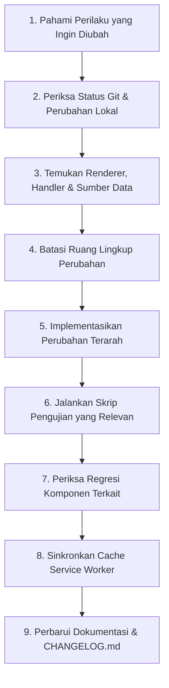

# Panduan Peningkatan (Upgrade Guide) TRJT 3A Reminder

Panduan ini ditujukan bagi pengembang dan agen coding yang akan melakukan penambahan fitur, perubahan desain, atau pemutakhiran versi pada sistem **TRJT 3A Reminder**.

---

## 1. Matriks Perubahan & Area Dampak

| Jenis Perubahan | Berkas yang Perlu Diperiksa | Dampak Terkait | Prosedur Validasi |
|---|---|---|---|
| **Mengubah Warna & Tema** | `css/student-ui.css`, `css/design-system.css` | Tampilan seluruh kartu, tombol, badge, kontras teks pada Dark Mode | Uji di tema Terang & Gelap; pastikan tidak menggunakan warna ungu |
| **Mengubah Kartu Jadwal** | `js/app.js` (`renderWeeklySchedule`), `css/student-ui.css` | Tampilan kartu jadwal mingguan, timeline waktu, tombol aksi materi/tugas | Buka tab Jadwal di mobile (390px) dan desktop (1280px); klik hari Senin–Jumat |
| **Mengubah Tata Letak Beranda** | `index.html` (`#view-beranda`), `css/student-ui.css`, `js/app.js` (`renderHeroCard`), aset banner | Header navy, hero dinamis di `.campus-cover`, delapan pintasan `.home-shortcuts` 4×2, ringkasan, agenda, tugas | Periksa satu `#hero-card-container`, 360/390/430/768/1280px, tema terang/gelap, dan status H-10; jalankan `node scratch/test-all-viewports.js` |
| **Mengubah Navigasi Bawah** | `index.html` (`.bottom-nav`, `.nav-primary`), `css/student-ui.css`, `js/app.js` (`switchTab`) | Lima tab dengan Jadwal terangkat di tengah; `body.home-active` mengikuti Beranda | Klik seluruh lima tab; pastikan tab aktif benar dan konten terbawah tidak tertutup dock |
| **Mengubah Modal / Dialog** | `index.html` (modal sheets), `css/design-system.css`, `js/app.js` | Tampilan bottom sheet, form input saat keyboard aktif, z-index penumpukan | Buka modal tambah tugas & piket; uji tombol tutup lingkaran dan scroll modal |
| **Menambah Fitur Tugas / Materi**| `js/assignment-service.js`, `js/material-service.js`, `index.html` | Struktur Firestore `courseAssignments` / `courseMaterials`, izin offline | Jalankan `node scratch/test-assignment-feature.js` |
| **Mengubah Sumber Roster Jadwal**| `js/data.js`, `firebase/seed-firestore.js`, `lib/reminder-engine.js` | Perhitungan kelas aktif, notifikasi H-10, data offline Android | Pastikan seluruh sumber jadwal sinkron (11 mata kuliah Semester 5) |
| **Mengubah Mesin Pengingat** | `js/app.js` (`processH10Reminder`), `firebase/functions/reminder-engine.js` | Pemicu alarm lokal, push FCM server, toleransi window H-10 | Jalankan `node scratch/test-h10-engine-comprehensive.js` |
| **Memperbarui Versi Aset PWA** | `sw.js`, `firebase-messaging-sw.js`, `index.html` (query `?v=...`) | Pembaruan cache browser mahasiswa, ketersediaan mode offline | Verifikasi cache name di DevTools Application > Service Workers |

---

## 2. Alur Kerja Standar (9 Langkah Peningkatan)

Setiap proses pembaruan wajib mengikuti alur kerja terstruktur berikut:

1. **Pahami Perilaku:** Identifikasi apakah perubahan bersifat estetika (CSS), perilaku (JS), data (Firestore/data.js), atau infrastruktur (Cloud Functions/Vercel).
2. **Periksa Status Git:** Jalankan `git status` dan `git diff` untuk memastikan pekerjaan sebelumnya tidak terhapus atau tertimpa tanpa sengaja.
3. **Temukan Sumber Kode:** Gunakan [FEATURE_MAP.md](FEATURE_MAP.md) untuk menemukan fungsi renderer dan ID kontainer yang relevan.
4. **Tentukan Ruang Lingkup:** Batasi perubahan pada komponen terkait (misalnya gunakan scope `.student-app` untuk antarmuka mahasiswa agar tidak mempengaruhi panel admin).
5. **Implementasikan Secara Terarah:** Edit berkas target dengan perubahan minimal yang efektif. Pertahankan kode yang sudah berfungsi.
6. **Jalankan Pengujian:** Jalankan skrip test terkait di folder `scratch/` (misalnya skrip pengujian piket, tugas, atau headless browser).
7. **Pengecekan Regresi:** Periksa tema terang dan gelap pada 360, 390, 430, 768, dan 1280px. Pastikan delapan menu dan lima tab bekerja, tanpa overflow atau konten tertutup dock.
8. **Sinkronkan Cache PWA:** Jika CSS, JS, atau aset visual berubah, naikkan query `?v=...` CSS/JS di `index.html`, nama cache di kedua service worker, serta daftar aset jika ada berkas baru.
9. **Dokumentasikan:** Catat penambahan atau perbaikan pada [CHANGELOG.md](../CHANGELOG.md) dan perbarui dokumen teknis terkait.

---

## 3. Sinkronisasi Service Worker & Cache

Perhatikan perbedaan peran versi berikut:

- **Versi Cache Service Worker (`sw.js` & `firebase-messaging-sw.js`):**
  Keduanya menggunakan konstanta `CACHE_NAME = 'trjt3a-reminder-v8.0'` pada versi dokumen ini. Naikkan nilainya bersama saat aset rilis berubah.
- **Daftar Aset Cache (`ASSETS`):**
  Setiap CSS, JS, atau gambar baru yang diperlukan secara offline wajib didaftarkan ke array `ASSETS` di kedua service worker.
- **Query Parameter Versi pada HTML (`index.html`):**
  Saat ini memakai `./css/student-ui.css?v=8.0` dan `./js/app.js?v=8.0`; samakan nomor saat versi cache dinaikkan.

---

## 4. Contoh Nyata Kasus Peningkatan

### Skenario: Memperbaiki Tampilan Kartu Jadwal Kuliah Tanpa Mengubah Data
**Tujuan:** Merapikan tata letak waktu dan tombol aksi pada kartu jadwal kuliah mingguan.

1. **Bagian yang WAJIB disentuh:**
   - [css/student-ui.css](file:///c:/laragon/www/TRJT%203A/css/student-ui.css): Sesuaikan aturan `.student-app .schedule-card`, `.schedule-time-col`, atau `.schedule-details`.
   - [js/app.js](file:///c:/laragon/www/TRJT%203A/js/app.js): Hanya pada fungsi `renderWeeklySchedule()` jika perlu mengubah struktur tag HTML yang dihasilkan.
2. **Bagian yang CUKUP diperiksa (JANGAN diubah):**
   - [js/data.js](file:///c:/laragon/www/TRJT%203A/js/data.js): Roster mata kuliah tidak perlu diubah.
   - [js/time-provider.js](file:///c:/laragon/www/TRJT%203A/js/time-provider.js): Logika waktu tidak perlu diubah.
   - [admin/index.html](file:///c:/laragon/www/TRJT%203A/admin/index.html): Panel admin tidak perlu disentuh.
3. **Validasi:**
   - Jalankan `node scratch/test-all-viewports.js` untuk memastikan kartu jadwal terender rapi dan tidak menimbulkan horizontal scroll di 360px dan 1280px.
